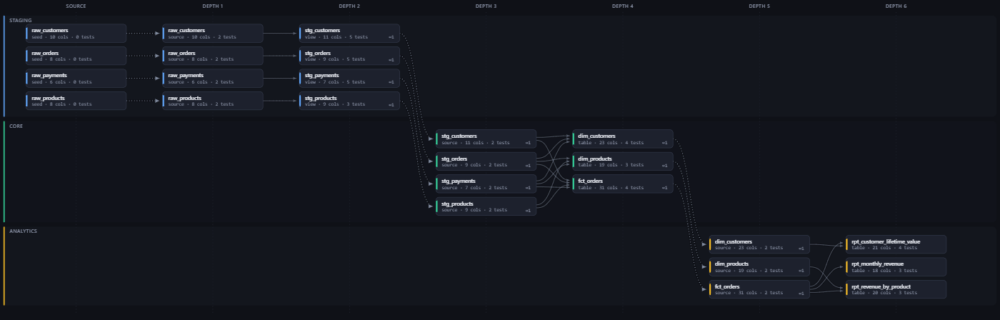

# dbt-multidocs

One lineage page across dbt projects that don't share a manifest.

- **[Getting started](getting-started.md)** — install, first build, what you get
- **[How linking works](linking.md)** — declared edges, inferred edges, and when inference fails
- **[CLI reference](cli.md)** — every command and flag
- **[Configuration](configuration.md)** — `dbt-multidocs.yml`
- **[Architecture](architecture.md)** — the pipeline and the payload shape
- **[Troubleshooting](troubleshooting.md)** — every warning, and what to do about it

[](lineage.html)

There is a rendered example page here: **[lineage.html](lineage.html)** — a real
build of three independent dbt projects. Open it and everything described in
these docs is in front of you.

## The short version

dbt gives you cross-project lineage only when the projects share a manifest.
Separate repos with separate `dbt docs generate` runs, linked by a downstream
project's `source()` pointing at a table an upstream project builds, come out as
disconnected islands.

`dbt-multidocs` merges N independent manifests and infers the missing edges by
matching normalized warehouse relations — `(database, schema, identifier)` —
between one project's models and another's sources.

```bash
pip install dbt-multidocs
dbt-multidocs build --project /repos/dbt_staging \
                    --project /repos/dbt_core \
                    --project /mnt/data/dbt_analytics \
                    --out docs/lineage.html
```

Output is one HTML file: no network calls, no JS dependencies, no dbt install,
no warehouse connection.

## Design constraints

These are deliberate, and PRs are held to them:

| | |
|---|---|
| **No runtime dependencies** | stdlib only, so it installs anywhere including CI and air-gapped hosts |
| **Artifacts only** | reads `target/manifest.json` and `target/catalog.json`; never runs dbt, never opens a connection, never reads `profiles.yml` |
| **One self-contained file** | the output opens from `file://`, survives being emailed, and makes no requests |
| **No assumed layout** | projects are unrelated repos; nothing is derived from a common parent, from the current directory, or from where the package is installed |
| **Inference is visible** | an edge the tool guessed is drawn differently from one dbt declared, always |
